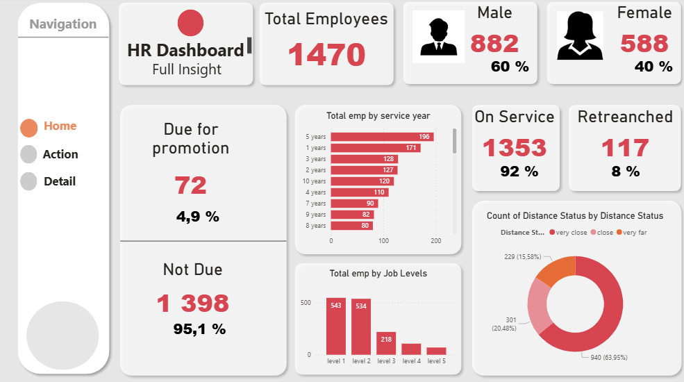
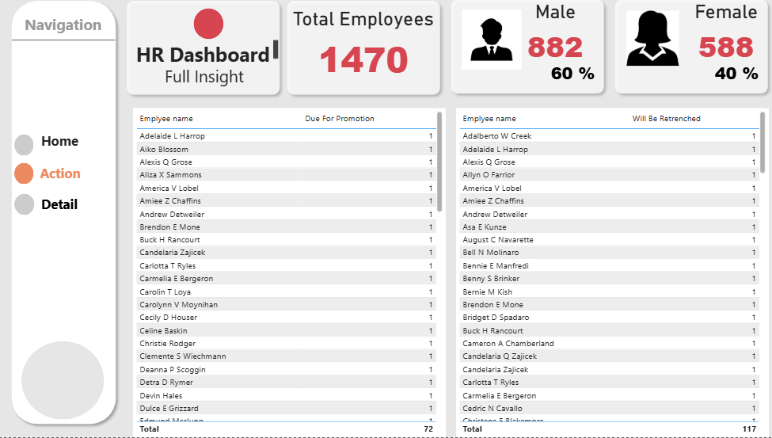
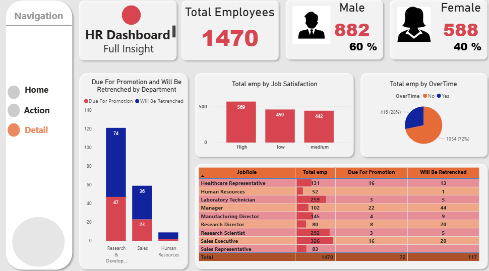

# 📊 HR Analytics & Employee Performance Dashboard

## 📝 Introduction
This project is a strategic HR dashboard designed to provide a comprehensive view of workforce dynamics, employee performance, and retention risks. Analyzing a dataset of **1,470 employees**, this tool empowers HR managers to monitor promotion eligibility, retrenchment risks, and demographic distributions to support data-driven talent management decisions.

---

## 🛠️ Skills & Tools Showcased

- **Complex Data Modelling**: Built relationships to analyze employee data across multiple dimensions such as Department, Job Role, and Satisfaction levels.
- **Advanced DAX Logic**: Formulated explicit measures to dynamically calculate critical rates:
  - **Promotion Eligibility**: 4.9%
  - **Retrenchment/Attrition Risk**: 8%
- **UI/UX & Navigation**: Implemented a custom side-bar navigation system using **Buttons and Bookmarks**, allowing users to seamlessly switch between the *Home*, *Action*, and *Detail* views.
- **Conditional Visuals**: Utilized color-coded visuals (Red/Blue) to distinguish between positive metrics (Promotions) and negative risks (Retrenchment) for immediate visual recognition.
- **Operational Reporting**: Designed tabular reports for actionable operational tasks, allowing HR to identify specific individuals requiring immediate attention.

---

## 🔍 Dashboard Overview

### 🏠 Page 1: Home (Executive Summary)

*The Mission Control for HR Management.*

- **Demographic Overview**: A high-level view of the workforce, broken down by gender (**60% Male, 40% Female**) and total headcount.
- **Key Status Indicators**: Highlights critical KPIs, identifying that **72 employees** are due for promotion while **117** face retrenchment risks.
- **Workforce Distributions**: Visualizes employee tenure (*"Service Year"*) and hierarchy (*"Job Levels"*), along with commute analysis (*"Distance Status"*), providing a clear snapshot of organizational stability.

### 🚀 Page 2: Action (Operational Lists)

*From Analysis to Action.*

- **Targeted Employee Lists**: This page shifts focus to operational details. It features detailed tables listing specific employee names who are **"Due For Promotion"** or **"Will Be Retrenched"**.
- **Decision Support**: Enables HR managers to export or view the exact list of personnel to initiate promotion cycles or severance processes efficiently.

### 📉 Page 3: Detail (Deep-Dive Analysis)

*Understanding the "Why" behind the numbers.*

- **Departmental & Role Analysis**: Breaks down promotion and retrenchment data by **Department** (e.g., R&D, Sales, HR) and **Job Role** (e.g., Sales Executive, Laboratory Technician) to identify specific problem areas.
- **Correlation Factors**: Explores potential causes for turnover or performance issues by analyzing **Job Satisfaction** levels and **OverTime** status (revealing that **28%** of employees work overtime).

---

## 💡 Key Business Insights

> **Business Scenario**: The organization was facing difficulty in manually tracking which employees were due for career progression versus those underperforming.
>
> **Solution**: This dashboard automates the categorization process. By isolating the **117 employees** at risk of retrenchment, HR can now intervene early with performance improvement plans, potentially saving recruitment costs for replacements.

---

## 🏁 Conclusion
This dashboard transforms raw HR data into a strategic asset. By combining high-level demographic trends with granular, actionable lists, it allows Human Resources departments to proactively manage talent, improve job satisfaction, and optimize organizational structure.